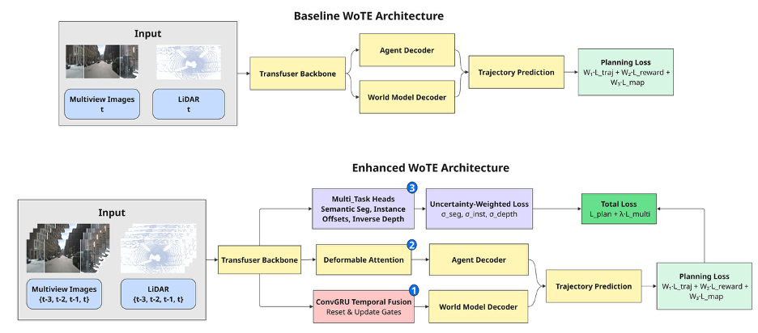

# 🚗 Investigating Temporal Modeling, Efficient Attention, and Adaptive Loss Balancing as Improvements to WoTE

**ROB 535 Final Project - Fall 2025**

This repository contains an ablation study of architectural enhancements to the **World Model for Trajectory Evaluation (WoTE)** framework. We investigate three proposed improvements: temporal BEV fusion via ConvGRU, deformable attention, and multi-task learning with uncertainty-weighted loss balancing. While temporal fusion was fully implemented, HPC resource constraints prevented its evaluation. The two tested enhancements—deformable attention and multi-task learning—both degraded performance compared to the baseline.

**Original WoTE Paper:** Yingyan Li*, Yuqi Wang*, Yang Liu, Jiawei He, Lue Fan† and Zhaoxiang Zhang† [[📄 arXiv:2504.01941]](https://arxiv.org/abs/2504.01941)  
**Original Repository:** [[🔗 liyingyanUCAS/WoTE]](https://github.com/liyingyanUCAS/WoTE)

> **Note:** Dataset preparation, installation, and baseline training instructions are adapted from the original WoTE repository.

<p align="center">
  
</p>

*Figure: Comparison of baseline WoTE (top) and our enhanced architecture (bottom) with three proposed modifications: ① ConvGRU Temporal Fusion, ② Deformable Attention, and ③ Multi-Task Learning with Uncertainty-Weighted Loss.*

---

## 📊 Performance Comparison

| Model Configuration | NC | DAC | EP | TTC | Comf. | PDM-Score | Failure Rate | Checkpoint |
|:-------------------:|:--:|:---:|:--:|:---:|:-----:|:---------:|:------------:|:----------:|
| **Baseline WoTE** | **94.2%** | **91.9%** | **57.5%** | **91.6%** | **92.5%** | **59.90%** | **31.6%** | [📥 Download](#checkpoints) |
| **Deformable Attention** | 93.7% | 91.6% | 57.3% | 91.4% | 92.2% | 59.32% | 32.3% | [📥 Download](#checkpoints) |
| **Multitask Learning** | 93.0% | 88.8% | 51.6% | 88.7% | 88.3% | 51.82% | 41.3% | [📥 Download](#checkpoints) |
| **Combined (Both)** | 93.5% | 90.1% | 54.4% | 90.2% | 90.2% | 57.16% | 34.5% | [📥 Download](#checkpoints) |

*All models trained on NAVSIM OpenScene split for 10 epochs on single NVIDIA A40 GPU.*  
*Evaluated on 12,146 test scenarios from NAVSIM test set.*

> **Legend**  
> • NC: No At-Fault Collision  
> • DAC: Drivable Area Compliance  
> • EP: Ego Progress  
> • TTC: Time-to-Collision  
> • Comf.: Comfort  
> • PDM-Score: Planning Distance Metric Score (overall metric)

---

## 🔬 1. Architectural Enhancements

We extend the baseline WoTE architecture with three proposed enhancements:

### Enhancement 1: Temporal BEV Fusion (ConvGRU)
- **Goal**: Enable velocity estimation and occlusion reasoning
- **Implementation**: Convolutional GRU aggregates 4 historical BEV frames with ego-motion compensation
- **Status**: ⚠️ **Implemented but not evaluated** - HPC storage limitations prevented training. Temporal fusion requires storing 4× the dataset size, exceeding our cluster allocation. The implementation is complete and available in `navsim/agents/WoTE/modules/temporal_fusion.py`.

### Enhancement 2: Deformable Attention
- **Goal**: Focus computation on spatially salient BEV regions
- **Implementation**: Sparse attention with K=8 learned sampling points (vs. full 8×8 grid)
- **Training**: 10 epochs on single A40 GPU
- **Result**: ❌ Marginal degradation (-0.58% PDM-Score) - computational overhead outweighs benefits

### Enhancement 3: Multi-Task Learning
- **Goal**: Regularize backbone with auxiliary supervision
- **Implementation**: 3 auxiliary heads (semantic segmentation, instance offsets, depth) with uncertainty-weighted loss
- **Training**: 10 epochs on single A40 GPU
- **Result**: ❌ Significant degradation (-8.08% PDM-Score) - task interference degrades planning

### Key Finding
**Architectural simplicity outperforms complexity.** Both tested enhancements degraded performance compared to baseline, demonstrating that sophisticated mechanisms don't guarantee better results in complex autonomous driving domains. The baseline model remains the recommended deployment configuration. Temporal fusion remains untested due to resource constraints—it may have been the most promising enhancement given its direct targeting of velocity estimation limitations.

---


## 📦 2. Dataset & File Structure

```bash
root/
├── ckpts/
│   └── resnet34.pth
├── dataset/
│   ├── maps/
│   ├── navsim_logs/
│   │   ├── test/
│   │   └── trainval/
│   ├── sensor_blobs/
│   │   ├── test/
│   │   └── trainval/
│   └── extra_data/planning_vb/
│       ├── trajectory_anchors_256.npy
│       └── formatted_pdm_score_256.npy
└── exp/
    └── metric_cache/
```

### 📁 a. Download NAVSIM Dataset

To obtain the [navsim dataset](https://github.com/autonomousvision/navsim/tree/main):

```bash
bash download/download_maps.sh
bash download/download_navtrain.sh
bash download/download_test.sh
```

### 📁 b. Prepare Extra Data

You can either download the extra data directly from [🌐 Google Drive](https://drive.google.com/drive/folders/1dIHK8nXkzhIhGCRQOpKibaizwH-7fHqs?usp=sharing) or generate the files manually:

- **K-means anchor trajectories** (`trajectory_anchors_256.npy`):

```bash
python scripts/misc/k_means_trajs.py
```

- **Reward generation** (`formatted_pdm_score_256.npy`):

```bash
bash scripts/misc/gen_pdm_score.sh
```

### 📁 c. Precompute Metric Cache

```bash
bash scripts/evaluation/run_metric_caching.sh
```

---

## ⚙️ 3. Installation

Create the conda environment:

```bash
conda env create -f environment.yml
conda activate wote
```

Install dependencies:

```bash
pip install -r requirements.txt
pip install git+https://github.com/motional/nuplan-devkit.git@nuplan-devkit-v1.2#egg=nuplan-devkit
```

Add environment variables to `~/.bashrc` (modify paths as needed):

```bash
export NUPLAN_MAP_VERSION="nuplan-maps-v1.0"
export NUPLAN_MAPS_ROOT="$HOME/navsim_workspace/dataset/maps"
export NAVSIM_EXP_ROOT="$HOME/navsim_workspace/exp"
export NAVSIM_DEVKIT_ROOT="$HOME/navsim_workspace/"
export OPENSCENE_DATA_ROOT="$HOME/navsim_workspace/dataset"
```

---

## 🚀 4. Training & Evaluation

**Note:** This project was developed on University of Michigan's Great Lakes HPC cluster using SLURM job scheduling.

### SLURM Job Scripts

All training and evaluation was performed via SLURM batch jobs. Pre-configured scripts are available in `slurm_jobs/final/`:

**Training Scripts:**
- `resume_baseline_wote.slurm` - Baseline WoTE training
- `resume_deformable_ablation.slurm` - Deformable attention variant
- `resume_multitask_ablation.slurm` - Multi-task learning variant
- `resume_combined_multitask_deformable.slurm` - Combined enhancements

**Evaluation Scripts:**
- `eval_baseline_wote.slurm` - Evaluate baseline model
- `eval_deformable_ablation.slurm` - Evaluate deformable attention
- `eval_multitask_ablation.slurm` - Evaluate multi-task learning
- `eval_combined_multitask_deformable.slurm` - Evaluate combined model

### Running on SLURM

```bash
# Submit training job
cd slurm_jobs/final
sbatch resume_baseline_wote.slurm

# Submit evaluation job
sbatch eval_baseline_wote.slurm

# Monitor job status
squeue -u $USER
```

### Running Locally (without SLURM)

Update paths in `navsim/agents/WoTE/configs/default.py`, then:

```bash
# Training
python navsim/planning/script/run_training.py \
  agent=WoTE_agent \
  experiment_name=WoTE/baseline_wote \
  scene_filter=navtrain \
  split=trainval

# Evaluation
python navsim/planning/script/run_pdm_score.py \
  agent=WoTE_agent \
  agent.checkpoint_path=exp/WoTE/baseline_wote/final_models/baseline_wote_epoch_10.ckpt \
  split=test
```

---

## 📊 5. Results & Model Checkpoints

### <a name="checkpoints"></a>📥 Model Checkpoints

Due to file size constraints (~700-810MB per model), trained checkpoints are hosted externally:

**🔗 [Download All Model Checkpoints (Google Drive)](https://drive.google.com/drive/folders/1yTPb9xEUMbPZNXhhFSHJ4axXCqX7mRna?usp=sharing)**

The folder contains:
- `baseline_wote_epoch_10.ckpt` (767 MB) - Baseline WoTE (59.90% PDM-Score)
- `deformable_ablation_epoch_10.ckpt` (767 MB) - With deformable attention (59.32%)
- `multitask_ablation_epoch_10.ckpt` (810 MB) - With multitask learning (51.82%)
- `eval_combined_multitask_deformable_epoch_10.ckpt` (810 MB) - Both enhancements (57.16%)

### To Use Downloaded Checkpoints

```bash
# Place checkpoint in final_models/ directory
mkdir -p final_models
mv baseline_wote_epoch_10.ckpt final_models/

# Run evaluation
python navsim/planning/script/run_pdm_score.py \
  agent=WoTE_agent \
  agent.checkpoint_path=final_models/baseline_wote_epoch_10.ckpt \
  split=test
```

### Reproducing Results

All evaluation results can be reproduced using the provided checkpoints and SLURM evaluation scripts. Expected PDM-Scores:
- Baseline: 59.90%
- Deformable: 59.32%
- Multitask: 51.82%
- Combined: 57.16%

---

## 📄 6. Citation & Acknowledgments

If you use this ablation study or find the negative results valuable for your research:

```bibtex
@misc{wote_ablation2025,
  title={Investigating Temporal Modeling, Efficient Attention, and Adaptive Loss Balancing as Improvements to WoTE},
  author={ROB 535 Final Project Team},
  year={2025},
  institution={University of Michigan}
}
```

**Original WoTE Paper:**
```bibtex
@article{li2025wote,
  title={End-to-End Driving with Online Trajectory Evaluation via BEV World Model},
  author={Li, Yingyan and Wang, Yuqi and Liu, Yang and He, Jiawei and Fan, Lue and Zhang, Zhaoxiang},
  journal={arXiv preprint arXiv:2504.01941},
  year={2025}
}
```

### Acknowledgments

This project builds upon the following open-source repositories:

- **WoTE Implementation:** [liyingyanUCAS/WoTE](https://github.com/liyingyanUCAS/WoTE) (Apache-2.0 License)
- **ConvGRU Module:** [happyjin/ConvGRU-pytorch](https://github.com/happyjin/ConvGRU-pytorch) (MIT License)
- **Deformable Attention:** [lucidrains/deformable-attention](https://github.com/lucidrains/deformable-attention) (MIT License)

We thank the authors for making their code publicly available.
